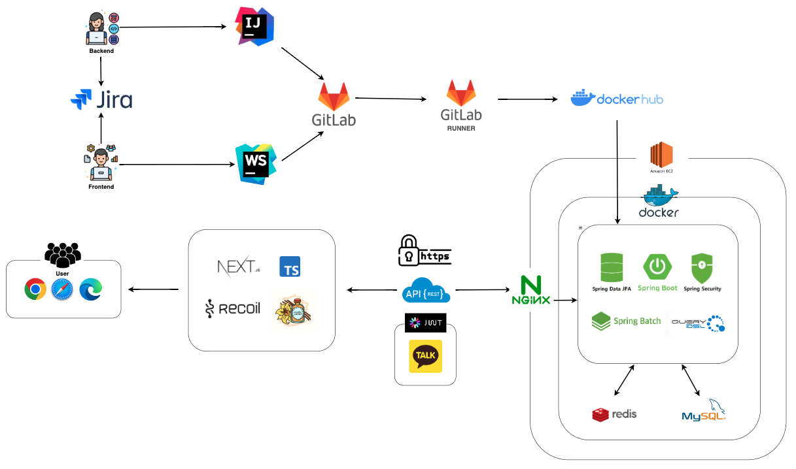
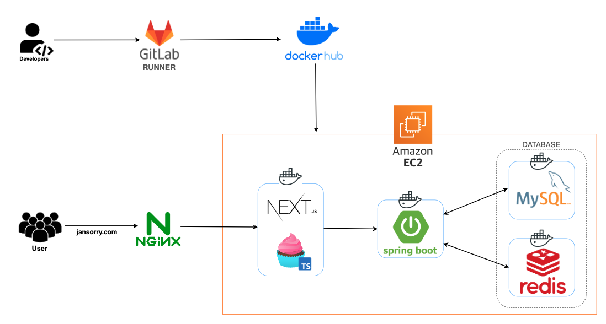
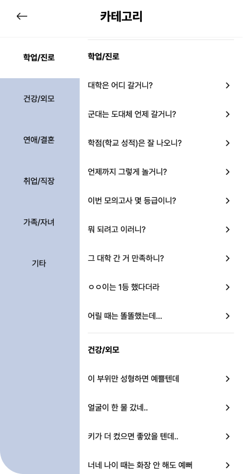
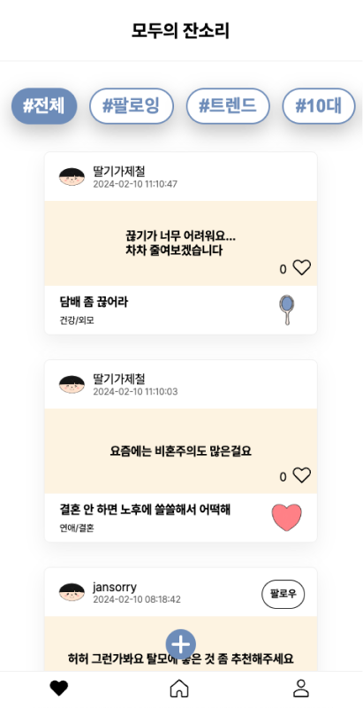
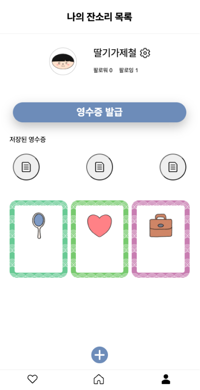

  

---

## 📚 TOC

- [BACKEND TEAMS](#backend-teams)
- [ROLE](#role)
- [DEPLOY URL](#deploy-url)
- [SPECIFICATION](#specification)
- [INTRODUCTION](#introduction)
- [SKILLS](#skills)
- [SYSTEM ARCHITECTURE](#system-architecture)
- [ERD](#erd)
- [SERVICE LAYOUT](#service-layout)
- [FUNCTION](#function)

 

---

## 🤝 Backend Teams

|  |  |  |
|:--------------------------------------------------------------------------------------------------------:|:----------------------------------------------------------------------------------------------------:|:--------------------------------------------------------------------------------------------------:|
|                                  [김건우](https://github.com/takealook97)                                   |                                 [이선주](https://github.com/sunju5402)                                  |                                 [김예림](https://github.com/ozllzlme)                                 |

---

## 🙋‍♂️ Role

### 김건우

- 팀장, 백엔드 리더
- 서버 CI/CD 구축 및 인프라 총괄
- ERD 및 시스템 아키텍쳐 설계
- Nag & Category(잔소리) API 구축
- Action(대응) API 구축
- Favorite(좋아요) API 구축
- Follow(팔로우) API 구축
- Receipt(영수증) API 구축
- Batch Job(스프링 배치 스케쥴링) 구축

### 이선주

- ERD 및 시스템 아키텍쳐 설계
- 초기 개발 환경 구축
- Member(회원) API 구축
    - JWT, Oauth2.0, Spring Security, 카카오 소셜 로그인
- Feed(피드) API 구축
- 마이 페이지 무한 스크롤 기능

### 김예림

- Main(로그인 후 첫 화면) API 구축
- Receipt(영수증) API 구축
- 기획 및 캐릭터 디자인 & 피그마
- PPT 기획 및 제작
- 광고 및 마케팅 & 촬영

---

## 🕊️ Deploy URL

- ✅ front-server : https://jansorry.com
- ✅ back-server : https://jansorry.store
- ✅ back-swagger : https://jansorry.store/swagger-ui/index.html

 

## 📝 Specification

- notion : https://takealook97.notion.site/jansorry-d926a1053a9e4e02ac849c5f1a3d263b?pvs=4

 

---

## 📢 Introduction

### main-service

- **명절 잔소리 영수증 서비스**
- 잔소리를 학업·진로, 건강·외모, 연애·결혼, 취업·직장, 가족·자녀, 기타 별로 카테고리를 나눠, 사용자가 해당 잔소리를 쉽게 찾을 수 있다.
- 잔소리에 대한 사용자의 경험 기반 대응을 등록할 수 있다.
- 실시간, 나이대별, 팔로잉, 트렌드 피드를 제공하고, 해당 피드에 좋아요 및 팔로우를 등록할 수 있다.
- 사용자가 들은 잔소리를 기반으로 영수증을 생성하고, 오픈 그래프를 활용하여 어른용, 친구용 영수증을 공유할 수 있다.

### sub-service

- 카카오 소셜 로그인
- 나이대/성별/전체를 기준으로 잔소리 통계
- 관리 페이지

 

---

## 🛠️ Skills

### language

- Java 17

### framework

- SpringBoot 3.2.1
- Spring Data JPA
- Spring Security
- Spring Batch
- QueryDSL

### sub

- JWT
- Oauth 2.0

### database

- MySQL 8.0.35
- Redis 7.2

### ci / cd

- AWS EC2
- gitlab-runner
- Docker, Docker Hub, Portainer
- Nginx Proxy Manager

 

---

## 🌐 System Architecture

 

## 💾 ERD

 

---

## 🏠 Service Layout

|  |  |  |
|:------------------------------------------------------------------:|:----------------------------------------------------------------:|:--------------------------------------------------------------------:|
|                             Main Page                              |                             My Card                              |                               Category                               |

|  |  |  |
|:------------------------------------------------------------:|:----------------------------------------------------------------:|:------------------------------------------------------------------:|
|                             Feed                             |                             My Page                              |                              Receipt                               |

 

---

## ⚙️ Function

### 🎯 회원

💡 회원은 Spring Security & JWT & Oauth2.0 사용하여 카카오 소셜 로그인 구현

- [x] 회원 가입
- [x] 로그인, 로그아웃
- [x] 마이페이지
- [x] 닉네임 수정
- [x] 회원 탈퇴 (soft deletion)
- [x] 팔로잉, 팔로워 목록

### 🎯 잔소리

💡 학업·진로, 건강·외모, 연애·결혼, 취업·직장, 가족·자녀, 기타 총 6개의 카테고리로 잔소리 분류

- [x] 잔소리 카드 상세 조회
- [x] 잔소리 카드 전체 조회 (카테고리별로 잔소리와 가격 제공)

### 🎯 잔소리 대응

💡 사용자가 받은 잔소리 경험에 대한 대응 생성

- [x] 대응 생성
- [x] 대응 상세 조회 (해당 사용자가 작성한 대응을 상세 조회)
- [x] 대응 전체 조회 (해당 사용자가 작성한 대응 목록들을 전체 조회, 무한스크롤)
- [x] 대응 삭제 (soft deletion)

### 🎯 피드

💡 실시간, 나이대, 팔로잉, 트렌드 별 잔소리-대응 피드 무한스크롤로 제공, 동시성을 고려하여 팔로우 및 좋아요 3초 디바운싱 적용

- [x] 실시간 피드 조회
- [x] 팔로잉 피드 조회
- [x] 나이대 별 피드 조회 (10/20/30대 별로 피드 조회)
- [x] 트랜드 피드 조회 (좋아요 순으로 30개의 피드를 뽑은 다음, 랜덤으로 10개 피드 제공)

### 🎯영수증

💡 영수증은 3개까지만 저장 가능 (어른용, 친구용 글자 크기 상이)

- [x] 영수증 저장 (3개까지만 저장 가능)
- [x] 영수증 상세조회 (3개중 n번째의 영수증 조회)
- [x] 영수증 삭제 (soft deletion)
- [x] 영수증 개수 확인

### 🎯 좋아요

💡 Redis에 좋아요 정보 저장 후, Spring Batch를 통해 MySQL에 반영

- [x] 좋아요 등록
- [x] 좋아요 취소

### 🎯 팔로우

💡 Redis에 팔로우 정보 저장 후, Spring Batch를 통해 MySQL에 반영

- [x] 회원 검색 (닉네임 기반 회원 조회)
- [x] 팔로잉 등록
- [x] 팔로잉 취소
- [x] 팔로잉 전체 조회
- [x] 팔로워 전체 조회

### ⏰ Batch

- 좋아요 및 팔로우 데이터는 기본적으로 Redis에 적재된다.
- 서버는 기본적으로 항상 MySQL이 아닌 Redis의 데이터를 클라이언트에 전달한다.
- 매일 새벽 3시에 update된 Redis 데이터를 MySQL로 동기화하는 작업을 진행한다.
    - Spring Batch + Scheduler
- 명절이 끝난 2024년 2/13 새벽 3시 batch 이후, 최종 데이터 통계 batch job을 진행한다.
    - 최종 데이터는 44가지의 다양한 통계로 나뉘어 MySQL에 적재된다.
    - 이 batch 작업이 끝나면 더 이상의 batch 작업은 진행되지 않는다.
    - 최종 데이터는 통계 페이지 자료로 활용된다.
